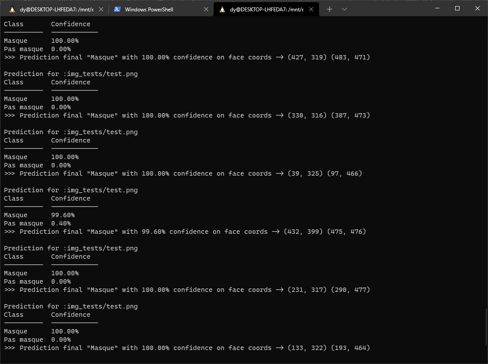
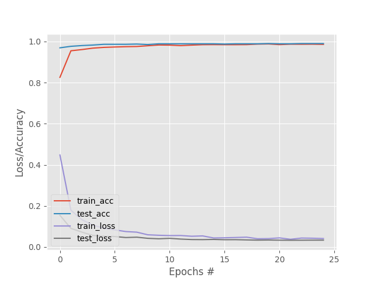
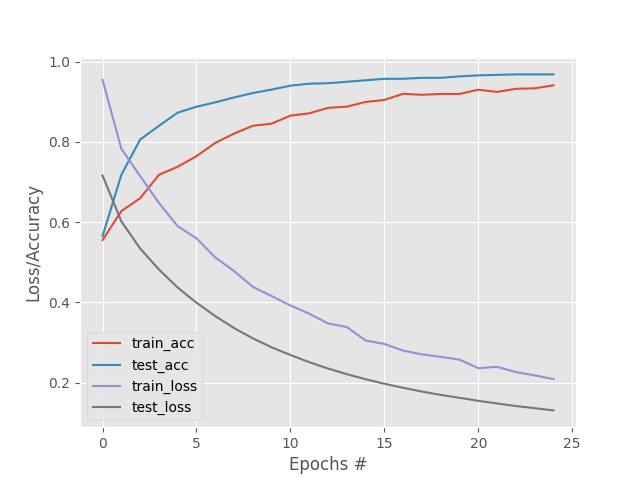
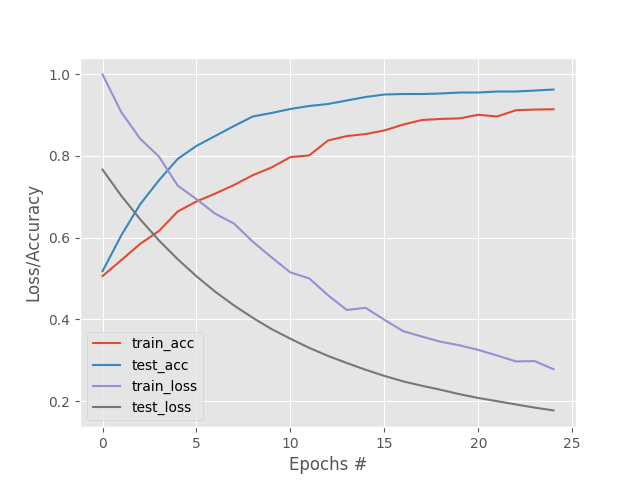
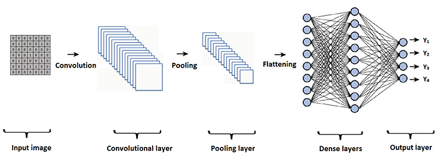

# Logiciel d'annotation d'images
## Objectif du logiciel

Le but de la première partie est de réaliser [un logiciel d’annotation d’images](https://github.com/MonsieurCo/facial-recognition) en python pour fournir un jeu de données à nôtre IA dans la seconde partie du projet.

Nous avons dû donner la possibilité à l'utilisateur d'encadrer une ou plusieurs parties de l'image puis de leur assigner une catégorie. Chaque cadre doit pouvoir être éditable, pour changer la catégorie ou supprimer le cadre. L’utilisateur doit pouvoir sauvegarder toutes ses annotations. En ce qui concerne les catégories il est nécessaire de pouvoir en importer, en ajouter ou en supprimer.

## Base de donnée

Pour récolter les données nécessaires à l'entrainement de l'IA nous nous sommes rendu sur [Kaggle](https://www.kaggle.com/swann00/masque-vs-sans-masque) où nous avons recherché un jeu de données composé de différentes personnes. Nos critères étaient d'y trouver des personnes dans diverses situations, de différents âges, ethnies et en nombre varié pour avoir une diversité suffisante, afin d'éviter les problèmes liés à un jeu de données trop réduit. Cependant les images nous semblent petites, nous verrons dans la seconde partie du projet si elles conviennent bien à nos besoins.

Pour la partie annotation, nous avons enregistré pour chaque image dans un JSON, un identifiant unique, les coordonnées des zones annotées associées au titre d'une catégorie, sa taille ainsi que le chemin vers cette dernière. En revanche la sauvegarde n'est pas automatique, il faut enregistrer à la fin de chaque session d'annotation dans un fichier JSON.


## Choix de conception


-  Méthodologie:
Pour mieux s'organiser au cours du projet nous avons utilisé l'outil de versioning git.
Cet outil nous a permis de travailler à plusieurs sur différentes branches en simultané et enfin de fusionner le tout pour avoir un produit tout le temps fonctionnel.

- Technologies : Python3.9.9
Pour réaliser l'interface graphique de ce projet nous nous sommes plutôt rapprochés d'une librairie externe nommée Qt, développée en C++ qui selon nous est plus ergonomique que le GUI classique de Python  tkinter.
Qt est une librairie très puissante et moderne c'est pourquoi nous voulions en apprendre plus dessus.
Les différentes librairies utilisées au cours du projet sont :
    
  - PySide6==6.2.1 (librairie Qt adapté pour python)
  - Pillow==8.4.0 (redimensionner des images)
  - Shapely==1.8.0 (intersections entre les rectangles)
    


## Répartition des tâches
Pour la répartition des tâches nous nous sommes organisés via GitHub et son système d'issues, mais aussi via Discord où nous recensions les bugs à réparer ainsi que les fonctionnalités à implémenter, nous passions par des phases de test où nous essayions de mettre le logiciel à l'épreuve pour détecter les bugs potentiels. 

Antoine s'est occupé de l'import et de l'export des données et des catégories, Dylann de toute la gestion des zones d'annotations, leur chevauchement, leur affichage et Margaux de la gestion des catégories, l'ajout, la suppression et la modification.

## Comment utiliser

NOTE: Pensez à mettre les droits d'exécution sur le fichier build.sh pour installer les dépendances et lancer l'application.

Pour lancer :
```
#!/bin/bash
chmod u+x build.sh
./build.sh
```
- Pour ouvrir un fichier ou un dossier via la menu-bar ou en effectuant un drag and drop sur la zone prévue à cet effet.
- Pour ouvrir une image, une fois le dossier ouvert, double-cliquez dessus et commencez à annoter.
- Pour sélectionner une zone vous pouvez appuyer sur clic gauche et étirer jusqu'à la taille souhaitée, la fenêtre de choix de categorie s'ouvre. Vous pouvez séléctioner une categorie et cliquer sur "Select category".
- Vous pouvez sélectionner plusieurs zones sur une même image.
- Pour supprimer une annotation faites clic droit sur la zone annotée de l'image.
- Pour éditer une annotation double-cliquez dessus, la fenêtre des choix de catégorie va apparaitre et vous pourrez éditer votre annotation.
- Pour éditer une catégorie double-cliquez dessus pour qu'elle devienne éditable, une fois la modification faite, appuyez sur "Change Category" pour valider le changement, qui se reportera dans le fichier JSON d'annotation.
- Pour supprimer une categorie selectionner là et cliquer sur "Delete category".
- Pour ajouter  une categorie écriver son nom dans la zone éditable en haut et cliquer sur "Ok".
-  CTRL + S : Sauvegarder.
-  CTRL + O : Ouvrir un fichier.
-  CTRL + SHIFT + O : Ouvrir un dossier.
-  CTRL + W : Quitter une image.
-  CTRL + H : Ouvrir ce README.


   
## Amélioration possible du logiciel

Nous avons pensé à implémenter un système de Ctrl-Z Ctrl-Y à l'avenir sur l'édition des zones d'annotations, c'est une fonctionnalité qui paraît simple en apparence mais nous demande beaucoup de travail en arrière-plan, invisible pour l'utilisateur.
Nous avons testé le logiciel à la recherche de bug, ce qui a permis d'en régler plusieurs lors de cette période. Nous n'en avons plus trouvé après les corrections de ceux recensés. 
Le projet étant très intéressant nous avons imaginé continuer le logiciel et peut-être faire en sorte d'annoter des vidéos pour que l'on puisse à partir d'une séquence obtenir une multitude d'images et entrainer l'IA sur celle-ci voir même sur des films.

## Conclusion du logiciel d'annotation

Lors de cette première partie nous avons donc réalisé ce logiciel de façon à ce qu’il nous convienne pour travailler pour la seconde partie. Nous avons implémenté les fonctionnalités qui nous semblaient utiles, pour pouvoir annoter efficacement les images. En effet si nous avons un logiciel ergonomique, nous faciliterons la phase de création du jeu de données d'images, pour nourrir notre algorithme. 

Cette partie nous a permis de prendre en main les librairies graphiques en python et de faire attention à l'efficacité du logiciel.
# Détection du port du masque

## Objectif de detection

Le but de la deuxième partie est de détecter les visages sur des images. Puis de classer ces visages dans une catégorie Masque ou Pas masque.
Pour cela nous avons dû concevoir une base de données, sélectionner et entrainer un modèle, trouver les meilleurs paramètres pour ce dernier et afficher les résultats prédits.

## Choix de conception

- Technologies : Python3.9.9
Pour réaliser la seconde partie du projet nous avons utilisé les librairies suivantes:
  - PySide6==6.2.2.1 (librairie Qt adapté pour python)
  - Pillow==9.0.0 (redimensionner des images)
  - tensorflow==2.7.0
  - opencv-python==4.5.5.62
  - tabulate==0.8.9
  - tqdm==4.62.3 
  - scikit-learn==1.0
  - matplotlib==3.4.3
  - numpy==1.22.0
    


Installation

Vous pouvez utiliser le fichier install.sh

```
$ chmod u+x install.sh
$ ./install.sh
```
soit
```
$ python3 -m pip install -r requirements.txt
```


## Comment utiliser

Ligne de commande

Commande d'aide : 
```
$ python3 main.py -h

usage: main.py [-h] [-i IMG_PATH] [-tr TRAIN] [-mp MODEL_PATH] [-e EPOCHS] 
[-b BATCH_SIZE] [-w WORKERS] [-dir DIR_PREDICT_PATH]

Predict classes of an image

optional arguments:
  -h, --help            show this help message and exit
  -i IMG_PATH, --image IMG_PATH
                        Image path (default: None)
  -tr TRAIN, --train TRAIN
                        Train the model
  -mp MODEL_PATH, --model_path MODEL_PATH
                        Path to the model (default: model.h5)
  -e EPOCHS, --epochs EPOCHS
                        Epoch size (default: 25)
  -b BATCH_SIZE, --batch_size BATCH_SIZE
                        Batch size (default: 32)
  -w WORKERS, --workers WORKERS
                        Number of workers (default: 1, if > 1 activate multiprocessing)
  -dir DIR_PREDICT_PATH, --dir_predict_path DIR_PREDICT_PATH
                        Path to the directory with images
```

Entrainer une IA :

```
python3 main.py --train true -w 8 -mp "model.h5" -e 40 -b 40
```

Entrainement de l'IA et utilisation de 8 workers avec 40 epochs et 40 batchs.


Prédire une image :

```
python3.9 main.py -i img_tests/test.png -w 8 -mp "model.h5"
```

Prédiction de l'image test.png et utilisation de 8 workers avec le modèle "model.h5"




Interface graphique

```
    python3 app.py
```

    - Pour ouvrir un fichier ou un dossier via la menu-bar ou en effectuant un drag and drop sur la zone prévue à cet effet.
    - Pour ouvrir une image, une fois le dossier ouvert, double-cliquez dessus et l'image avec les predictions va s'ouvrir.


- CTRL + i : Importer un modèle.
- CTRL + o : Ouvrir un fichier.
- CTRL + SHIFT + O : Ouvrir un dossier.


## Jeu de Données

Afin d'entrainer le réseau de neurones nous avons préparé un jeu de données en utilisant le logiciel réalisé dans la première partie. Nous sommes partis d'une banque de 200 images disponibles sur [kaggle.com](https://www.kaggle.com/swann00/masque-vs-sans-masque), la même que dans la première partie.
Nous avons ensuite annoté les images en indiquant la présence ou l'absence de masque sur un visage.
Une fois nos images annotées nous exportons ces informations sous un format JSON que nous couplons aux images mises au bon format (.png).
Par la suite nous recadrons les images en fonction des zones annotées et les plaçons dans un dossier portant le nom de leur catégorie, via un programme de compréhension de notre ficher d'annotations que nous avons réalisé.  
Après quelques tests les résultats étaient présents mais pas assez précis. 
Pour que notre modèle ait plus de diversité nous nous sommes basés sur un autre jeu de données d'environ 2000 images pour détecter les masques et 2000 images sans masques, ce dataset est disponible sur [GitHub](https://github.com/balajisrinivas/Face-Mask-Detection/tree/master/dataset).

Une fois cette étape finie nous pouvons construire un objet en python nommé ImageDataGenerator nous permettant de normaliser les images recadrées (même taille, même encodage couleur, ...). Cela nous permet aussi de faire de l'augmentation de données, en produisant des rotations ou des changements de couleurs pour éviter les problèmes liés au surapprentissage (overfitting). 

Arboresence du dossier utilisé pour le jeu de données.

```
dataset
|
+───Masque
|
└───Pas masque
```

## Implémentation et choix du modèle

Nous avons décidé de nous appuyer sur un modèle préexistant de l'api **Keras** nommée **ResNet50V2** qui nous fournit 50 layers optimisés pour pouvoir entrainer nos IA. 
Il en existe d'autres mais nous n'avons pas pu tous les tester par manque de temps et nous avons rapidement eu des résultats convenables avec ce genre de modèle.
En effet entrainer un modèle est une tâche longue, ce qui nous a ralenti dans notre recherche d'un modèle adapté.


## Test du modèle

Nous avons vu qu’il était important de faire varier les paramètres dans le but de faire augmenter la précision (accuracy) et diminuer le taux d’erreur.
Nous avons donc fait varier les paramètres epochs et batch_size ainsi que les layouts.

L'epoch est une itération complète sur des échantillons. Le nombre d'epochs correspond au nombre de fois où l'algorithme va s'exécuter. Le nombre d'epoch affecte le résultat de l'étape d'apprentissage.

La Batch Size définit le nombre d'échantillons d'images qui seront introduits dans chaque itération du modèle. la Batch_size est l'optimisation du poid du modèle, c'est à dire le nombre d'images effectuées en une étape de l'epoch. Si la Batch_size est égale à 3, le modèle entrera 3 exemples d'images et seulement après ces 3 entrées, il mettra à jour les poids (weigths).


La loss est une valeur qui représente la somme des erreurs dans notre modèle. elle mesure comment se porte notre modèle. Si les erreurs sont élevées, la Loss sera élevée, ce qui signifie que le modèle ne fait pas du bon travail. Sinon, plus la valeur est basse, mieux notre modèle fonctionne.

L'accuracy mesure à quel point notre modèle prédit bien en comparant les prédictions du modèle avec les vraies valeurs.

## Epochs


  


Lorsque nous avons fait varier les epochs nous avons choisi de fixer la batch\_size arbitrairement à 40. On peut voir ici qu’à partir de 5 epochs l’accuraccy n’augmente plus de manière significative tandis que la loss diminue encore. Entre 30 et 40 la loss ne diminue quasiment plus. Nous avons donc choisi de garder epochs = 40.

## Batch size





On peut voir dans les graphiques ci-dessus qu’avec l’augmentation des batch_size l’accuracy augmente plus doucement. Plus la batch_size est grosse plus le nombre d'epochs doit être grand. Il nous faut une batch\_size relativement élevé pour pouvoir reconnaitre une grande variété d’images. 


## Layers

En entrée nous avons utilisé le modèle énnoncé précedemment le modèle ResNet50V2, nous nous sommes appuyés ensuite sur un type de modèle CNN (Convolution Neural Network) spécialisé dans la vision par ordinateur pour la classification d'images. 

Un CNN est << un type de réseau de neurones artificiels acycliques (feed-forward), dans lequel le motif de connexion entre les neurones est inspiré par le cortex visuel des animaux. Les neurones de cette région du cerveau sont arrangés de sorte qu'ils correspondent à des régions qui se chevauchent lors du pavage du champ visuel. Leur fonctionnement est inspiré par les processus biologiques, ils consistent en un empilage multicouche de perceptrons, dont le but est de prétraiter de petites quantités d'informations. Les réseaux neuronaux convolutifs ont de larges applications dans la reconnaissance d'image et vidéo, les systèmes de recommandation et le traitement du langage naturel. >> d'après *Wikipedia*. 



## Détection des visages
Pour détecter les visages sur une image pour ensuite les analyser avec notre modèle, nous nous sommes servis d'un modèle de détection de visages éxistant via l'api [caffemodel](https://fileinfo.com/extension/caffemodel) combiné à **OpenCV** qui nous permet d'utiliser des modèles de DeepLearning pour cibler les zones que nous analysons avec notre modèle.
Une fois la classification de la tranche de l'image faite, nous encadrons le visage et mettons une étiquette de la classe estimée.


## Problèmes rencontrés

Une fois le modèle trouvé nous avons voulu essayer de classifier les masques FFP2, en tissus et chirurgicaux. Pour cela nous avons complété notre base de données avec plusieurs autres trouvées sur internet ainsi que des images récoltées à la main. Malheureusement cela n’a pas fonctionné. Nous soupçonnons que cela est dû à notre base de données peut-être trop petite ou de mauvaise qualité.


## Exemples
Voici quelques exemples de la détection sur certaines images:


## Répartition des tâches

Lors de cette partie nous avons eu plus de mal à découper le travail en tâches distinctes, nous avons donc codé en simultané via la fonction liveshare de Visual Studio Code. Nous avons effectué des recherches et testé des modèles. 
Avant de commencer le travail de programmation nous avons fait des sessions d'annotations d'images via notre logiciel.
Nous avons recherché des jeux de données, téléchargé des images, cela a été une partie non négligeable de notre travail.


## Améliorations possible du logiciel
En terme d'améliorations, nous avons pensé essayer plusieurs modèles et les entrainer sur une longue période avec un jeu de données plus conséquent.
Nous pourrions aussi extraire d'un flux vidéo, une séquence d'images et appliquer notre modèle en temps réel sur le retour d'image, pour observer la détection, à partir d'une caméra.

## Conclusion
Ce projet nous a permis de nous rendre compte de la puissance des réseaux de neurones et de la phase d'entrainement souvent cachée. 
Nous nous sommes rendus compte qu'entrainer une IA était un processus lourd pour l'ordinateur, génerer une base de données en utilisant le logiciel d'annotations était fastidieu, mais une fois tout cela fait, c'est avec plaisir que nous avons pu observer le fonctionnement de notre IA.
Nous avons vu plusieurs manières de réaliser un modèle de classification et de détection mais aussi de l'entrainer ou même de construire le jeu de données.


# Contributeurs

- [Dylann B](https://github.com/takitsu21)
- [Margaux Schmied](https://github.com/margauxschmied)
- [MonsieurCo](https://github.com/MonsieurCo)
